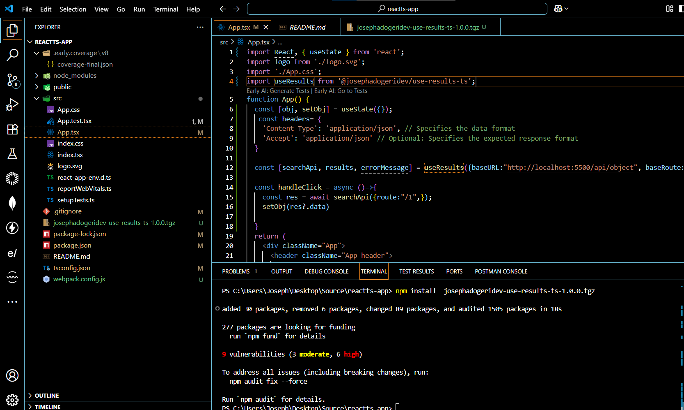

# **USE RESULTS TS**

**Version:** 1.0.0
**Date:** July 7, 2025

---

## Description ##

This is a typescript npm package for retreiving data from api. This react hook abstracts fetch API implementaion.

## Authors ##

[@jadogeri](https://www.github.com/jadogeri)

## Repository ##

 [https://github.com/jadogeri/useResults-TS.git](https://github.com/jadogeri/useResults-TS.git)

## Registory ##

[https://www.npmjs.com/package/@josephadogeridev/use-results-ts](https://www.npmjs.com/package/@josephadogeridev/use-results-ts)

## Screenshots ##

|  |  |
| -------------------------------------------- | -------------------------------------------- |
|                                              |                                              |

## Table of Contents ##

<ul>
      <li><a href="#1-introduction">1. Introduction</a>
        <ul>
          <li><a href="#11-purpose">1.1 Purpose</a> </li>
          <li><a href="#12-scope">1.2 Scope</a> </li>
          <li><a href="#13-intended-audience">1.3 Intended Audience</a> </li>
        </ul>
      </li>
    </ul>
    <ul>
      <li><a href="#2-technology-stack">2. Technology Stack</a>
      </li>
    </ul>
    <ul>
        <li><a href="#3-usage">3. Usage</a> </li>
        <ul>
            <li><a href="#30-install-dependency">3.0 Install Dependency</a> </li>
        <li><a href="#31-initialization">3. Initialization</a> </li>
        <ul>
            <li><a href="#310-useresults-hook-call-arguments">3.1.0 Use Results Hook Call Arguments</a> </li>
            <li><a href="#311-useresults-hook-return-array">3.1.1 Use Results Hook Return Array</a> </li>
            <li><a href="#312-searchapi-function">3.1.2 Search API Function</a> </li>
        </ul>
            <li><a href="#32-code-snippet">3.2 Code Snippet</a> </li>
        </ul>
    </ul> 
    <ul>
        <li><a href="#4-tests">4. Tests</a> </li>
        <ul>
            <li><a href="#41-test-using-jest">4.1 Test using Jest</a> </li>
            <li><a href="#42-test-using-npm-pack">4.3 Test using npm pack</a> </li>
        </ul>
    </ul> 
    <ul>  
        <li><a href="#5-license">5. License</a>
        </li>
    </ul> 
    <ul> 
        <li><a href="#6-references">6. References</a>
        </li>
    <ul>

## 1. Introduction ##

### 1.1 Purpose ###

This document outlines the package architecture, components, and design considerations for Fetching Data from an API. The goal is to create a reusable hook which abstracts Fetch API implementation.

### 1.2 Scope ###

This package will allow users to:

- Fetch data (GET) from an api.
- Allows headers to be set after initialization.
- Results utilize state management.

### 1.3 Intended Audience ###

- Junior or Senior developers.
- Beginners learning javascript.

---

### 2. Technology Stack ##

- **Programming Languages**: Typescript
- **IDE**: Visual Studio Code (VSCode)
- **Test**: Jest
- **Plugins**: Early AI
- **Registory**: NPM (Node Package Manager)
- **Source Control**: Git and GitHub
- **CI/CD**: GitHub Actions
- **Code Analysis**: SonarQube

---

## 3. Usage ##

### 3.0 Install Dependency ###

1 Type npm install @josephadogeridev/use-results-ts to install dependencies.

```bash
  npm install @josephadogeridev/use-results-ts
```

### 3.1 Initialization ###

#### 3.1.0 useResults Hook Call Arguments ####

| Name        | Type   | Description                                        | Requirement              |
| ----------- | ------ | -------------------------------------------------- | ------------------------ |
| baseURL     | String | The base url for a set of related URLs of the API. | Required                 |
| baseRoute   | String | The initial route or path of the API.             | Required                 |
| baseHeaders | Object | The initial headers of the API.                   | Optional, defaults to {} |

#### 3.1.1 useResults Hook Return Array ####

| Name        | Type   | Description                                        | Requirement              |
| ----------- | ------ | -------------------------------------------------- | ------------------------ |
| searchApi    | Function | calls the API with argurments. | Required, <i>See <a href="#312-searchapi-function">SearchApi Function</a> for usage</i> .            |
| results   | Array, any[] | The data fetched from the API.             | Required, display data retrieved                |
| errorMessage | String | Display error returned from the API.                   | Required, debugging |

searchApi, results, errorMessage
#### 3.1.2 searchApi function ####

| Name    | Type   | Description                                | Requirement              |
| ------- | ------ | ------------------------------------------ | ------------------------ |
| route   | String | The path to a resource. | Required                 |
| params  | Object | The params appended to query srting.       | Optional, defaults to "" |
| headers | Object | Sets the headers of the api call .         | Optional, defaults to {} |

### 3.2 Code Snippet ###

```typescript

import React, { useState } from 'react';
import logo from './logo.svg';
import './App.css';
import useResults  from '@josephadogeridev/use-results-ts';
function App() {
  const [obj, setObj] = useState({});
  const headers= {
    'Content-Type': 'application/json', // Specifies the data format
    'Accept': 'application/json' // Optional: Specifies the expected 
  }
    
  const [searchApi, results, errorMessage] = useResults({baseURL:"http://localhost:5500/api/object", baseRoute:"/", baseHeaders: headers});
  
  const handleClick = async ()=>{
    const res = await searchApi({route:"/1",});
    setObj(res?.data)

  }
  return (
    <div className="App">
      <header className="App-header">
        
        <p>
          {JSON.stringify(obj, null ,4)}
          {/* Edit <code>src/App.tsx</code> and save to reload. */}
        </p>
        <div
          className="App-link"
 
        >
          <button onClick={()=>{handleClick()}}>get random obj</button>
        </div>

          {JSON.stringify(results, null, 4)}
          <p>test</p>

      </header>
    </div>
  );
}

export default App;


```

## 4. Tests ##

#### 4.1 Test Using Jest ####


1 Inside of root directory, type npm run test to run unit tests.

```bash
  npm run test
```


```typescript

import logo from './logo.svg';
import './App.css';
import useResultsJs from '@josephadogeridev/use-results-ts';

function App() {

  const [searchApi, results, errorMessage] 
    = useResultsJs({baseURL:"http://localhost:5000", baseRoute:"/"})
  return (
    <div className="App">
      <header className="App-header">
        
        <button onClick={(()=>{ searchApi({route:"/objects/"} )})}>
          press
        </button>
        <p>
          Edit <code>src/App.js</code> and save to reload.
        </p>
        <p>
          {JSON.stringify(results,null,4)}
        </p>      
      </header>
      <div>
      </div>
    </div>
  );
}

export default App;

```

##### Example #####


#### 4.2 Test using NPM Pack ####

Note : this test was done pre publish to npm manager

1 In the root of package run npm run build to generate build (./dist).

```bash
  npm run build
```


2 In the root of package run npm pack to package the module into a zipped file (.tgz).

```bash
  npm pack
```


3 Create or use existing React Application.

4 Copy and paste the created file in the root of a React Application.

5 Run command npm install josephadogeridev-use-results-ts-1.0.0.tgz to install created package.

```bash
  npm install josephadogeridev-use-results-ts-1.0.0.tgz
```



## 5. License ##

[LICENSE](/LICENSE)

---

## 6. References ##

* FreeCodeCamp : [Frontend Web Development: (HTML, CSS, JavaScript, TypeScript, React)](https://www.youtube.com/watch?v=MsnQ5uepIa).
* AweSome Open Source : [Awesome Readme Templates](https://awesomeopensource.com/project/elangosundar/awesome-README-templates)
* Readme.so : [The easiest way to create a README](https://readme.so/)
* Mockingoose : [How to test mongoose models with jest and mockingoose](https://dev.to/darkmavis1980/how-to-test-mongoose-models-with-jest-and-mockingoose-2k10)
* NPM : [Creating nodejs modules](https://docs.npmjs.com/creating-node-js-modules)
* Dev.io : [Testing npm packages before publishing](https://dev.to/vcarl/testing-npm-packages-before-publishing-h7o)
* FreeCodeCamp : [How to create and publish an NPM Package - step by step guide](https://www.freecodecamp.org/news/how-to-create-and-publish-your-first-npm-package/)
* Dev.io : [Create and Publish NPM Package for custom Hooks in React JS](https://dev.to/shivampawar/create-and-publish-npm-package-for-custom-hooks-in-react-js-5237)